<h1 align="center">
   
</h1>

<h4 align="center"> 
	🚧 CheckPlay 🚀 Concluido...  🚧
</h4>

## ✅ Funções

- <h3>PRINCIPAL</h3>

  - [x] HOME
  - [x] GERENCIAMENTO DE CATEGORIAS

- <h3>ADMINISTRAÇÃO DE USUÁRIOS</h3>

  - [x] GERENCIAMENTO DE USUÁRIOS
  - [x] GERENCIAMENTO DE GRUPOS
  - [x] GERENCIAMENTO DE PERMISSÕES

## 📚 Descrição

🚀 CheckPlay — Meu catálogo pessoal de metas de entretenimento

Sempre gostei de definir metas, e uma delas era organizar meu universo de jogos e livros. Entre consoles, emuladores e uma estante cheia, eu precisava de uma forma prática (e divertida) de acompanhar tudo o que estava pendente, em progresso ou finalizado.
Assim nasceu o CheckPlay. 🎮📚✅

O projeto começou como uma forma de catalogar meu acervo — incluindo consoles como Super Nintendo, Nintendo 64, PS1, PS2, PS3, Wii e Xbox — e rapidamente evoluiu para um software completo de controle de metas de entretenimento por categoria.

💻 Tecnologias e Arquitetura

- Front-end: desenvolvido em React, atualmente hospedado na Vercel.

- Back-end: construído em Spring Boot, com Keycloak para autenticação e AWS S3 para armazenamento de mídia.

- Banco de dados: MySQL.

- Infraestrutura: pipelines automatizados com Jenkins e análise de qualidade de código via SonarQube.

📱 Estou estudando React Native e planejo levar o projeto também para o mobile, mantendo o mesmo ecossistema moderno e integrado.

Hoje, o CheckPlay já está em uso — e acompanhar meus progressos entre jogos e livros nunca foi tão divertido! 😄

💡 CheckPlay nasceu de uma necessidade pessoal e se tornou um projeto completo de software, integrando tecnologias modernas e boas práticas de desenvolvimento.

#SpringBoot #React #Keycloak #MySQL #AWS #Vercel #Jenkins #SonarQube #ReactNative #DesenvolvimentoDeSoftware #ProjetosPessoais #Entretenimento #CheckPlay

## 🛠 Tecnologias

As seguintes ferramentas foram usadas na construção do projeto:

-  [Flutter](https://flutter.dev/?gclid=Cj0KCQjwkbuKBhDRARIsAALysV4sMSKWcOxrlBmdtlCcf3MAfNdH1ehbbWi6ZjjjdypPLsSvdTFiqOYaAon3EALw_wcB&gclsrc=aw.ds)
-  [Dart](https://dart.dev/)

## 📱 Plataforma adotada

- Android;
- iOS;

## 📸 Screenshot

	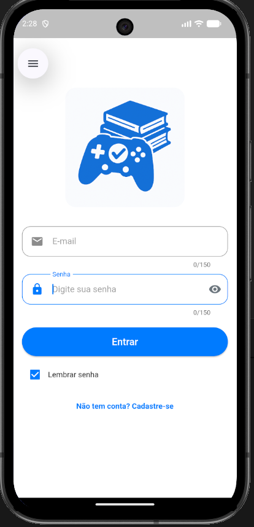
	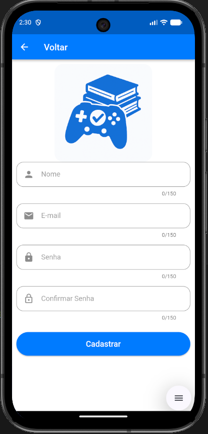
	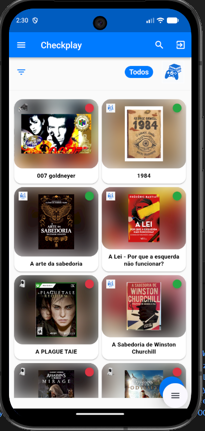
	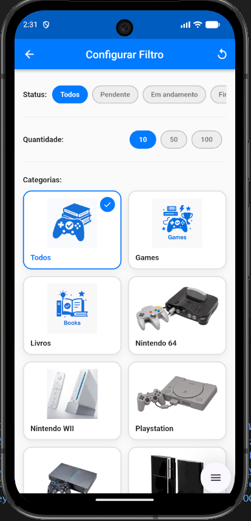
	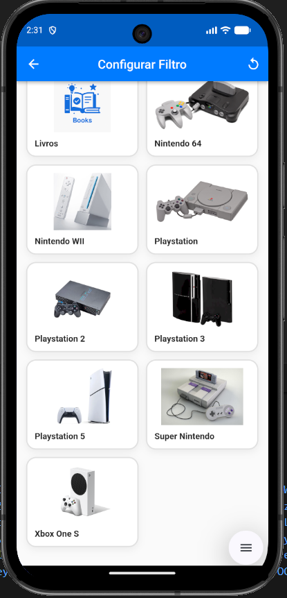
	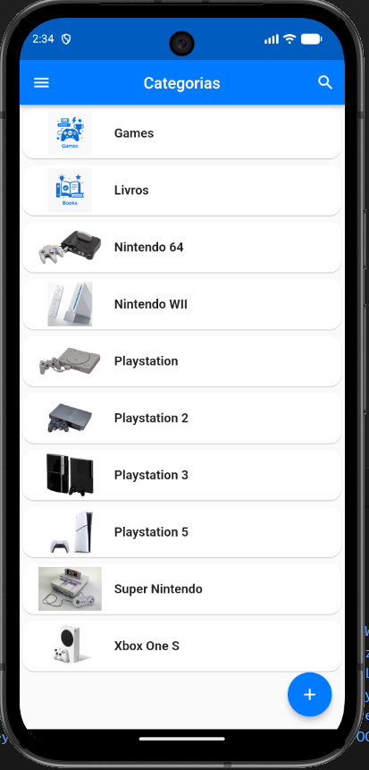
	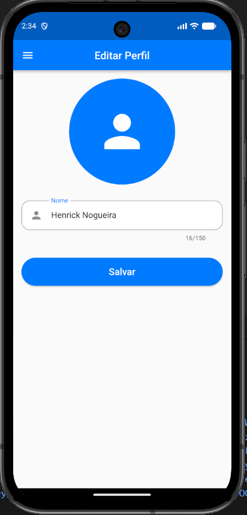
	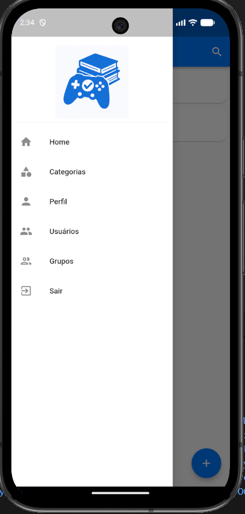
	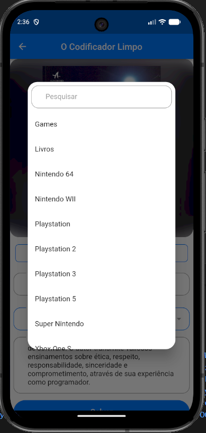
	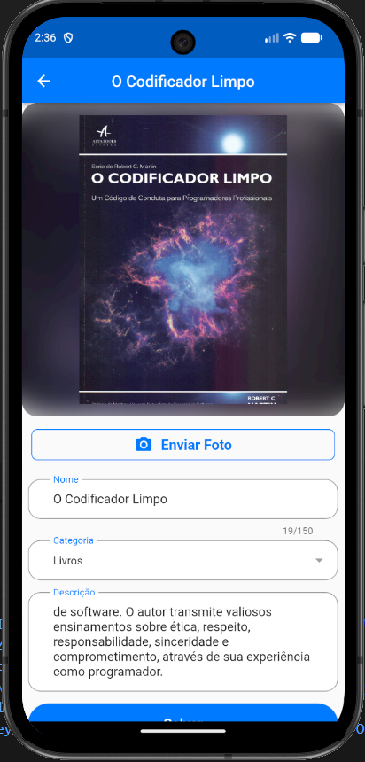
	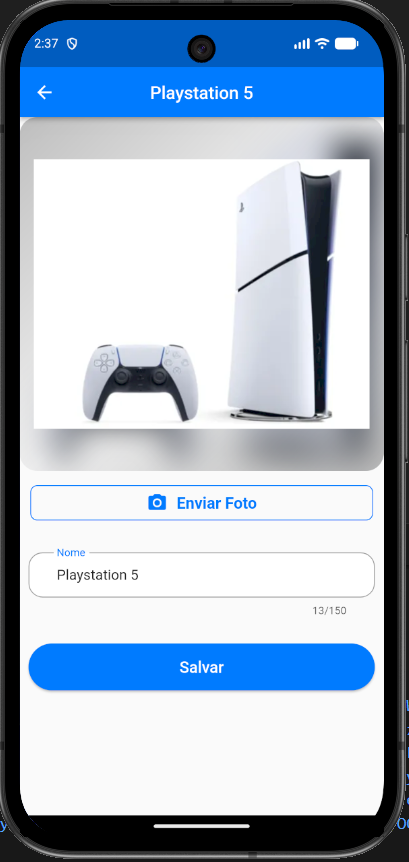
	
	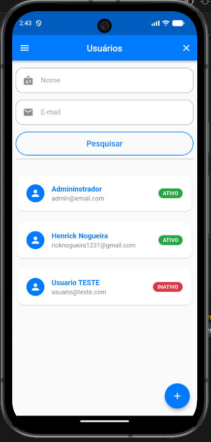
	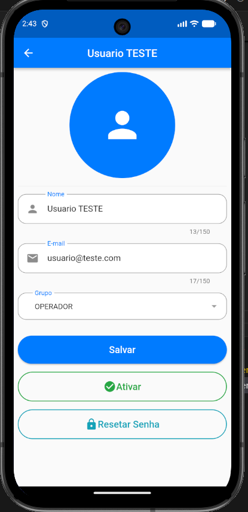
	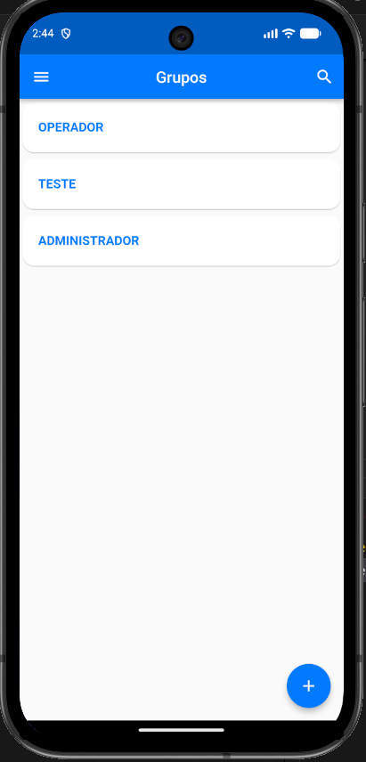
	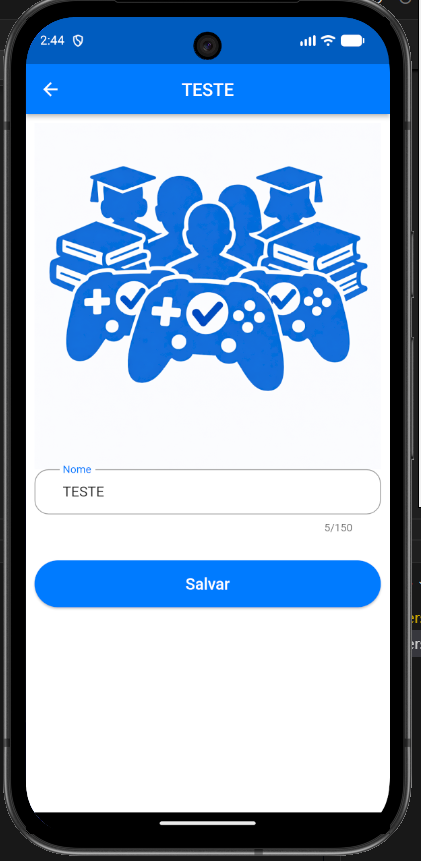

